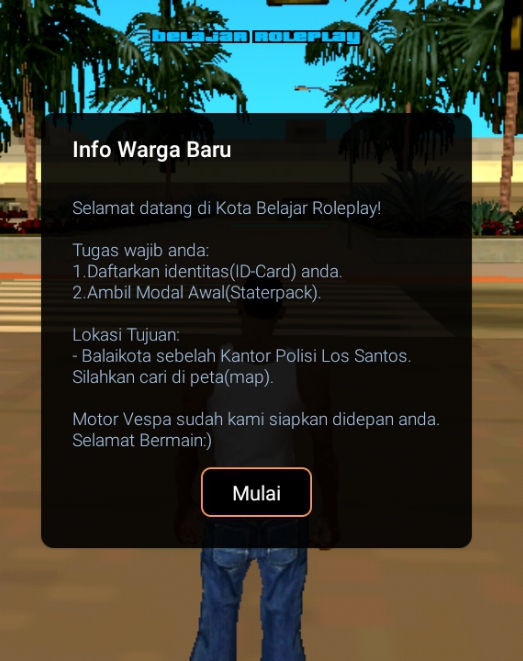
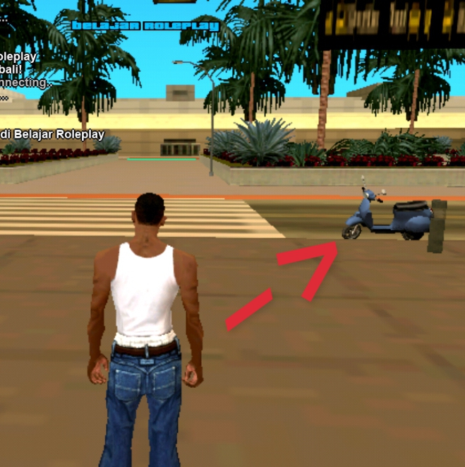
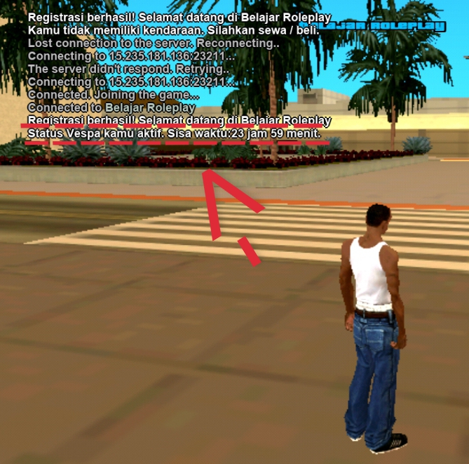
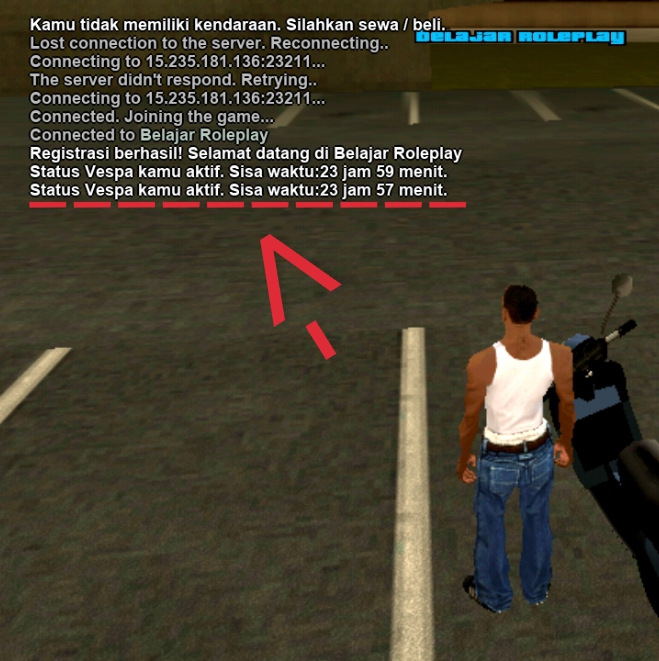

# 🚀 Belajar-SAMP-Part-2: Dialog & Kendaraan Starter

Penambahan Fitur Inti: Sistem Dialog Selamat Datang dan Manajemen Kendaraan Sementara.

[](https://opensource.org/licenses/MIT)
[](https://github.com/jodymilton05/Belajar-SAMP-Part-2)
[](https://www.sa-mp.com/)
[](https://youtube.com/@jodymilton05?si=-dZ_DPW0H4nDMlx5) 
[]()

---

## ✍️ Oleh : Jody Milton

Halo semuanya! Balik lagi sama gua, **Jody Milton**.

Kali ini gua akan ajak kalian lagi untuk melanjutkan proyek belajar kita "**Belajar SAMP**". Gua akan menambahkan **fitur** baru yang berguna untuk server Roleplay dasar.

Tujuan gua buat proyek ini adalah membantu kalian yang ingin **belajar** membuat Server Roleplay **SA:MP**, terutama bagi kalian yang menggunakan **Handphone** (dengan emulator seperti Winlator atau Exagear) untuk kompilasi.

---

## Fitur-Fitur Baru (V2.0)

Proyek ini fokus pada dua penambahan fitur:

1.  **Dialog Sambutan Selamat Datang (*Welcome*)**
2.  **Kendaraan Starter + Waktu Sementara**

---

## Penjelasan Fitur

- **Dialog Sambutan**
  Pesan kotak dialog yang muncul ke pemain baru, berisi panduan awal dan informasi lokasi penting.  |
- **Memunculkan Kendaraan**
  Motor Vespa otomatis muncul di dekat pemain baru. Waktu aktif kendaraan dihitung sejak registrasi.  |
  **Cek Waktu (/veh)**
  Perintah untuk memantau sisa waktu. Waktu yang ditampilkan berkurang secara *real-time*. **Waktu Awal Spawn**:  **Waktu Berkurang**: 

---

## Persyaratan

Pastikan kalian sudah memiliki atau membaca proyek "**Belajar SAMP Part 1**" sebagai dasarnya.

### Include Tambahan

Untuk proyek kali ini, kita akan menambahkan *include* baru untuk membantu dalam *perbaikan* dan stabilitas skrip:

| File | Versi | Link |
| :--- | :--- | :--- |
| **Crashdetect** | Terbaru | [https://github.com/Y-Less/samp-plugin-crashdetect/releases/tag/v4.22](https://github.com/Y-Less/samp-plugin-crashdetect/releases/tag/v4.22) |

> **NOTE**
> Jika *link* *download* menyediakan versi Linux dan Win32, *download* keduanya sesuai dengan instruksi pada proyek sebelumnya.

---

## 💻 Pembahasan Kode

Pembahasan kode detail ada di file **`new.pwn`**. Berikut adalah bagian awal yang krusial:

### 1. Include Baru 

Tambahkan *include* baru di bagian atas file **`new.pwn`**, di bawah *include* yang sudah ada:

```pawn
#include <crashdetect>
```

### 2. Define Dialog + Kendaraan + Waktunya

Tambahkan *Define* baru dibagian atas file **`new.pwn`** dibawah *define* yang sudah ada:

```pawn
#define DIALOG_WELCOME 

// Define Kendaraan + Waktu
#define VEH_MODEL 462
#define VEH_X 1690.5836
#define VEH_Y -2323.7197
#define VEH_Z 13.3828
#define VEH_A 85.0
#define TEMP_VEH_DURATION 86400
```

Note:
1. **462** itu adalah ID dari kendaraan Vespa, kalian bisa ganti dengan kendaraan yang kalian mau.
2. Untuk angka **Koordinat VEH_X - A** kalian bisa sesuaikan dengan koordinat tempat munculnya kendaraan tersebut didalam ingame, menggunakan /pos yang udah gua bahas di Proyek **"Belajar SA-MP Part 1"**.
3. **86400** itu adalah angka dari 24 jam diubah ke detik.

### 3. Fungsi Public Baru

Tambahkan fungsi **Public** baru dibawah ini, dibagian **`public`** di bawah *public OnPlayerClickMap*. yang udah gua bahas juga di proyek **"Part 1"**.

```pawn
public OnPlayerWelcome(playerid)
{
    if(!PlayerLogged[playerid])
    {
        SendClientMessage(playerid, -1, "Kamu harus login terlebih dahulu.");
        return 1;
    }
    
    new title[64], body[500], b1[16];
    format(title, sizeof(title), "Info Warga Baru");
    format(body, sizeof(body), "Selamat datang di Kota Belajar Roleplay!\n\n");
    strcat(body, "Tugas wajib anda:\n");
    strcat(body, "1.Daftarkan identitas(ID-Card) anda.\n");
    strcat(body, "2.Ambil Modal Awal(Staterpack).\n\n");
    
    strcat(body, "Lokasi Tujuan:\n");
    strcat(body, "- Balaikota sebelah Kantor Polisi Los Santos.\n");
    strcat(body, "Silahkan cari di peta(map).\n\n");
    
    strcat(body, "Motor Vespa sudah kami siapkan didepan anda.\n");
    strcat(body, "Selamat Bermain:)");
    format(b1, sizeof(b1), "Mulai");
    
    ShowPlayerDialog(playerid, DIALOG_WELCOME, DIALOG_STYLE_MSGBOX, title, body, b1, "");
    
    CreateVehicle(VEH_MODEL, VEH_X, VEH_Y, VEH_Z, VEH_A, -1, -1, 60000);
    return 1;
}
```

Note: 
1. Ubah tulisan didalam tanda petik dua **( " )** sesuai dengan kemauan kalian.
2. Angka **-1, -1, dan 60000** (Didalam kode "CreateVehicle") artinya: -1 dan -1 itu adalah ID dari warna 1 dan warna 2 dari kendaraan (-1 = warna random), dan untuk 60000 itu adalah hitungan waktu (dalam milidetik) agar kendaraan muncul kembali ketika dihancurkan. 

### 4. + (public OnDialogResponse)

Setelah sudah membuat dialognya, kita buat juga respon dari dialog **Welcome** tersebut. didalam fungsi ***`public OnDialogResponse`***, dibawah blok kode **DIALOG_LOGIN**.

```pawn
if(dialogid == DIALOG_WELCOME)
   {
       return 1;
   }
```

Note:
Mungkin dari kalian binggung, kenapa cuman di isi dengan return 1; karna di fungsi public **`OnPlayerWelcome`** kita sudah membuat lengkap ya. jadi kita tidak perlu memerlukan apa apa di respon nya.

### 5. CMD: veh

Kita akan menambahkan sebuah Command(cmd) untuk kendaraaan ya, berfungsi untuk mengecek apakah pemain mempunyai kendaraan atau belum dan untuk menunjukan sisa waktu sementara dari kendaraan. Taruh di bagian **`Command`** dibawah **CMD** **`/pos** yang udah, gua bahas juga di **Part 1**.

```pawn
CMD:veh(playerid, params[])
{
    if(!PlayerLogged[playerid])
    {
        SendClientMessage(playerid, -1, "Kamu harus login terlebih dahulu.");
        return 1;
    }
    
    new accpath[64];
    AccountPath(playerid, accpath, sizeof(accpath));
    
    new expiration_time = dini_Int(accpath, "TempVehExpire");
    
    if(expiration_time >0)
    {
        new current_time = gettime();
        
        if(current_time >= expiration_time)
        {
            dini_IntSet(accpath, "TempVehExpire", 0);
            SendClientMessage(playerid, -1, "Batas waktu 24 jam Vespa anda sudah berakhir.");
        }
        else
        {
            new remaining_seconds = expiration_time - current_time;
            new remaining_hours = remaining_seconds / 3600;
            new remaining_minutes = (remaining_seconds % 3600) / 60;
            
            new message[128];
            format(message, sizeof(message), "Status Vespa kamu aktif. Sisa waktu:%d jam %d menit.", remaining_hours, remaining_minutes);
            SendClientMessage(playerid, -1, message);
        }
    }
    else
    {
        SendClientMessage(playerid, -1, "Kamu tidak memiliki kendaraan. Silahkan sewa / beli.");
    }
    return 1;
}
```

## Command Tambahan

| Command | Deskripsi |
| :--- | :--- |
| /veh | Untuk mengecek pemain memiliki kendaraan dan juga memunculkan waktu sementara (jika pemain mempunyai kendaraan)

## Penutup

Okelah Begitu saja, **Belajar SA-MP Part 2** dari gua, next gua bakal lanjutin lagi...
Buat kalian yang masih belum paham, kalian boleh ke **Channel Youtube** gua, yang udah gua taruh juga link nya diatas itu ya😉.
Gua Jody, sampai jumpa di Sesi **Belajar SA-MP** part selanjutnya. **Terimakasih**😌🙏.

## 📜 Lisensi

Proyek ini bertujuan untuk edukasi dan dikembangkan di bawah Lisensi **Lisensi MIT**. Lihat berkas `LICENSE` untuk detail.
